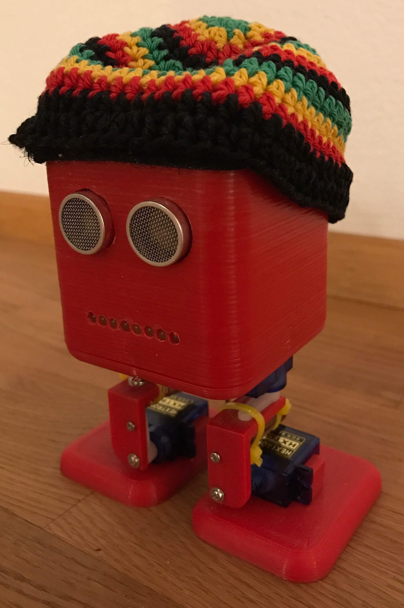
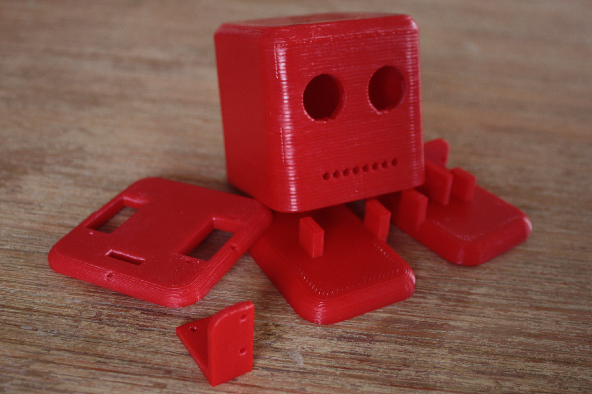
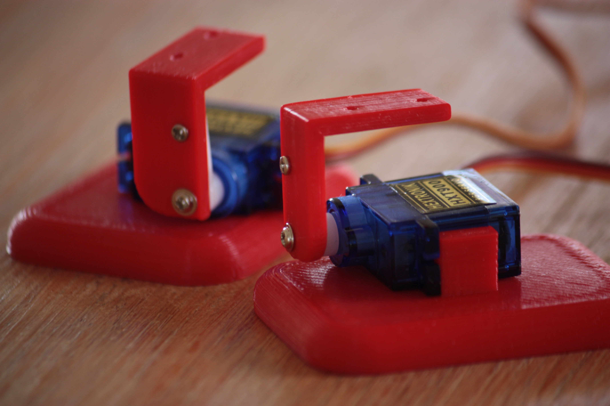
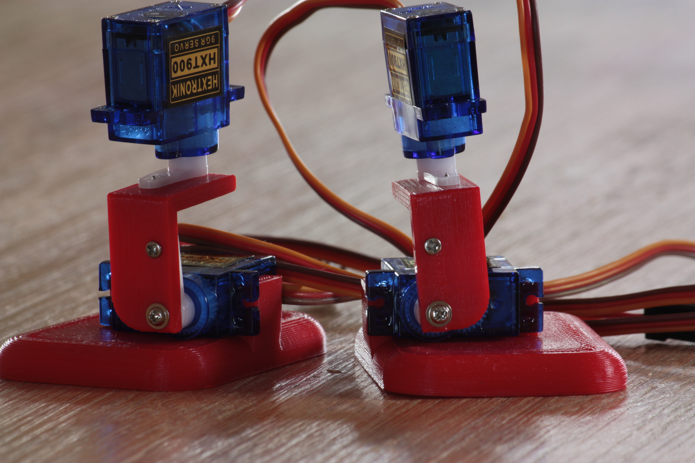
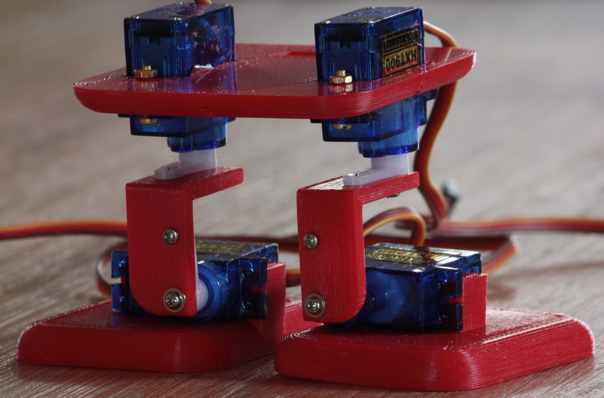

# BoB Marley the BiPed

### Parts

* Printed parts 
* Arduino Pro Mini
* 4 Servos (HXT900)
* 4xAAA battery pack
* SRF05 - Ultra-Sonic Ranger
* Pololu Adjustable Step-Up/Step-Down Voltage Regulator S7V8A
* 74HC595
* LEDs/Resistors

### Links

* [BoB the BiPed on instructables](http://www.instructables.com/id/BoB-the-BiPed/)
* [Thingiverse](http://www.thingiverse.com/thing:43708)
* [BoB-Bipeds by robofreak](https://github.com/robotfreak/BoB-Bipeds)
* [Makezine - Bob the Biped](http://makezine.com/2013/08/25/build-your-own-biped-robot/)

### Images

